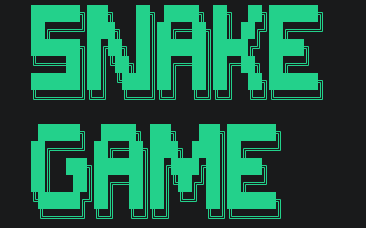

<div align="center">

# 🐍 Console Based Snake Game in C++

### A classic arcade Snake Game built in terminal using arrays, loops, collision detection, and real-time keyboard controls.


<br>


<br><br>


</div>

---

## 📖 About The Project

This project is a **console-based implementation of the classic Snake Arcade Game** developed in **C++** using procedural programming fundamentals.

The game executes entirely inside the terminal and demonstrates:

- real-time keyboard event handling,
- frame-based rendering,
- snake body movement using arrays,
- random food generation,
- score management,
- wall and self collision detection,
- restart and quit controls.

It is a strong beginner-to-intermediate systems programming project that builds confidence in low-level game logic without external graphics libraries.

---

## 🎮 Live Gameplay Preview

<p align="center">
  
</p>

---

## 🐍 GitHub Contribution Snake

<p align="center">
  <picture>
    <source media="(prefers-color-scheme: dark)" srcset="https://raw.githubusercontent.com/arya-dev2005/Snake-Game/output/github-snake-dark.svg" />
    <source media="(prefers-color-scheme: light)" srcset="https://raw.githubusercontent.com/arya-dev2005/Snake-Game/output/github-snake.svg" />
    
  </picture>
</p>

---

## ✨ Key Features

| Feature | Description |
|---------|-------------|
| 🎯 Real-Time Input | Uses `_kbhit()` and `_getch()` for non-blocking keyboard capture |
| 🐍 Dynamic Snake Growth | Snake length increases after consuming food |
| 🍎 Random Food Logic | Food spawns randomly within board boundaries |
| 💥 Collision Engine | Detects self-hit and wall-hit conditions |
| 📊 HUD Display | Live score, length, controls, objective shown on top |
| 🔁 Restart Option | Allows replay after Game Over |
| 🎨 Console Styling | Colored borders and terminal UI enhancement |

---

## 🧠 Core Programming Concepts Used

### ✅ Arrays for Snake Body Coordinates

```cpp
int tailX[100], tailY[100];